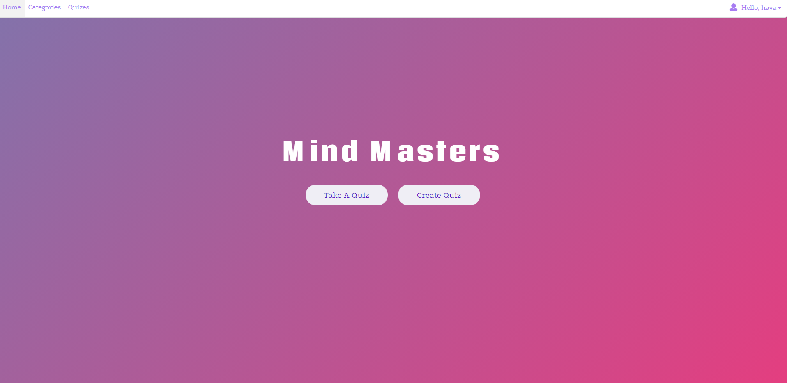
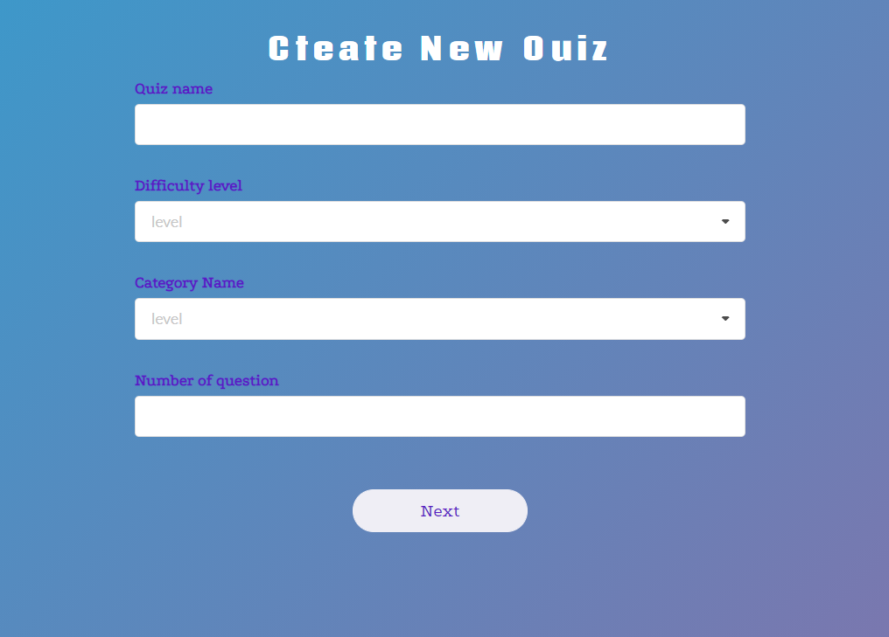
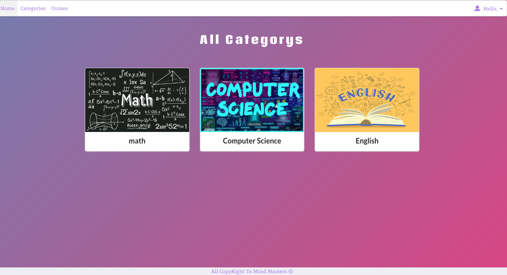

# Mind-Masters_Back-End
Mind Meister allows the user to create a quiz or select a quiz from a category on many subjects to measure the knowledge of the participants on a given topic, short test of knowledge typically around 10 questions in length, with question formats including multiple choice answer. With MindMasters users can do the quiz online, in their own time, with their device, regardless of where they live. You only need a browser and an internet connection

# Team member:
1. Nawaf Alsaif 
2. Hind Fahad Alotibi
3. Sarah Alsharif

# Important Links
![Mind-Masters_Back-End]:(https://git.generalassemb.ly/nawafsa/Mind-Masters_Back-End)

# Planning Story
- Start meeting twice in day to think and start coding and help each other to solve problem

# User Stories:
1. As a registered user, I want to access all pages by using the navbar 
2. As a user I want to registered /login/ logout of the site so i can take quiz or 
3. As a registered user I want to select any Quiz or create Quiz
4. As a registered user I want to select  the quiz by category and review the results and show the result  
5. As a registered user I want to edit the profile 
6. As a registered user I want to upload image to profile 
chose from category

# Technologies Used
1. VS code
2. React.js 
3. semantic-ui
4. axios
5. dotenv
6. semantic-ui-css
7. semantic-ui-react-form-validator
8. sweetalert
9. use-state-with-callback
10. CSS3

# Unsolved Problems
* Show the user quiezzes on the profile and delete

# App Screenshot:

